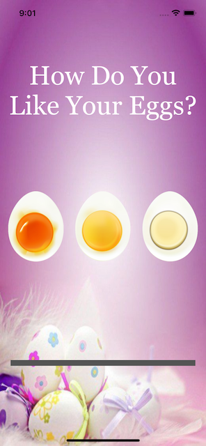
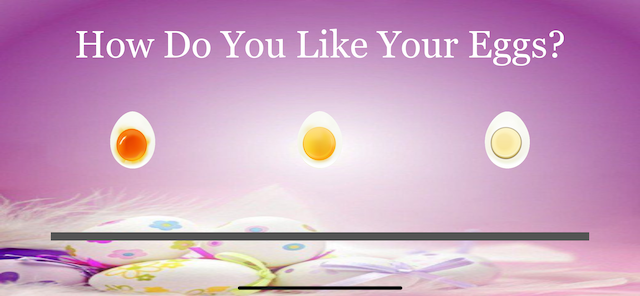

# EggTimer-IOS

## Project Description

An application that serves as a timer for desired cook of an egg. This application was built to test our knowledge of the following modules:

	- Swift Collection Types (Dictionaries)
	- The Swift Timer API
	- Conditional Statements (If-Else / Switch)
	- Functions with Outputs
	- How To Use The ProgressView

## Technologies Used

1. XCode 13 - IDE
2. Swift 5 - Programming Language
3. UIKit - Interface Builder

## Sample Look

<h3>Portrait</h3>

<h3>Landscape</h3>

<h3>Application At Work</h3>

")
<h6><i>Click on image to see video</i></h6>

## Credits

Adding Shadow To ImageView:

	- https://stackoverflow.com/questions/65593236/add-shadow-to-image-in-uikit

App Logo

	- <a href="https://www.flaticon.com/free-icons/kitchen-timer" title="kitchen timer icons">Kitchen timer icons created by Freepik - Flaticon</a>

App Background

	- https://www.pinterest.com/pin/all-you-need-to-make-your-own-easter-cards-page-borders--518899188315122368/

## Note
This is a companion project to The App Brewery's Complete App Development Bootcamp, check out the full course at [www.appbrewery.co](https://www.appbrewery.co/)