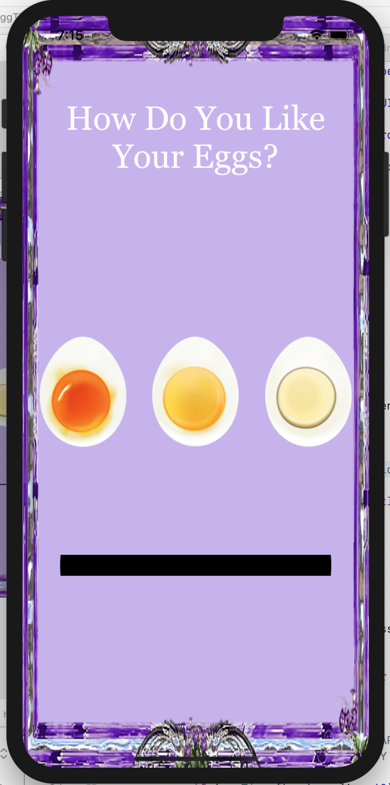
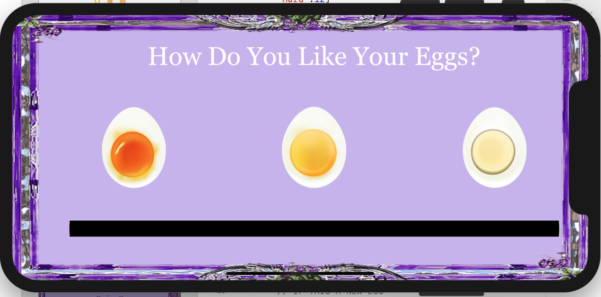

# Egg-Timer
An application built to test our knowledge with the modules learned during the IOS Development Boot Camp. It includes:

	- Swift Collection Types (Dictionaries)
	- The Swift Timer API
	- Conditional Statements (If-Else / Switch)
	- Functions with Outputs
	- How To Use The ProgressView

## Screenshots

1. Portrait Orientation

2. Landscape Orientation

3. Application In The Work

<iframe width="560" height="315" src="https://www.youtube.com/embed/yd6qzyN6Nbs" frameborder="0" allow="accelerometer; autoplay; encrypted-media; gyroscope; picture-in-picture" allowfullscreen></iframe>

## Note
This is a companion project to The App Brewery's Complete App Development Bootcamp, check out the full course at [www.appbrewery.co](https://www.appbrewery.co/)